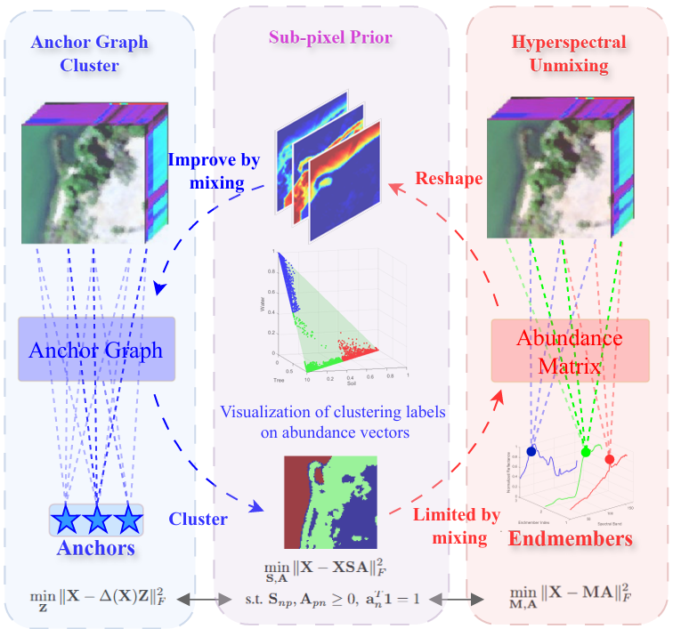

# Subpixel Anchor Graph for Multimodal Clustering of Hyperspectral and LiDAR

This repository provides the official implementation of the paper:

> **Subpixel Anchor Graph for Multimodal Clustering of Hyperspectral and LiDAR**


---

## 🔍 Motivation

Hyperspectral images are severely affected by mixed-pixel effects, whereas LiDAR data provide complementary geometric information. Most existing multimodal clustering methods rely on pixel-level representations, which limits their capability to capture fine-grained subpixel structures inherent in hyperspectral data. Inspired by hyperspectral unmixing, we propose a Subpixel Anchor Graph Clustering (SAGC) framework that transforms the mixed-pixel effect into a clustering-beneficial prior, thereby enhancing the effectiveness of multimodal clustering.


<p align="center">
  
</p>

## 🚀 Quick Start

To quickly run a demo of the proposed method, simply execute:
```bash
python demo_Trento.py
```

## 📖 Citation
If you find this work useful, please consider citing:

```bibtex
@ARTICLE{11300910,
  author={Liu, Yang and Liu, Shujun and Xiao, Luxi},
  journal={IEEE Transactions on Geoscience and Remote Sensing}, 
  title={Subpixel Anchor Graph for Multimodal Clustering of Hyperspectral and LiDAR Data}, 
  year={2025},
  volume={63},
  number={5536915},
  pages={1-15},
  keywords={Hyperspectral imaging;Vectors;Laser radar;Scalability;Clustering methods;Optimization;Land surface;Earth;Clustering algorithms;Accuracy;Anchor graph learning;deep learning;hyperspectral (HS) unmixing (HU);multimodal remote sensing (RS)},
  doi={10.1109/TGRS.2025.3644663}}
```


